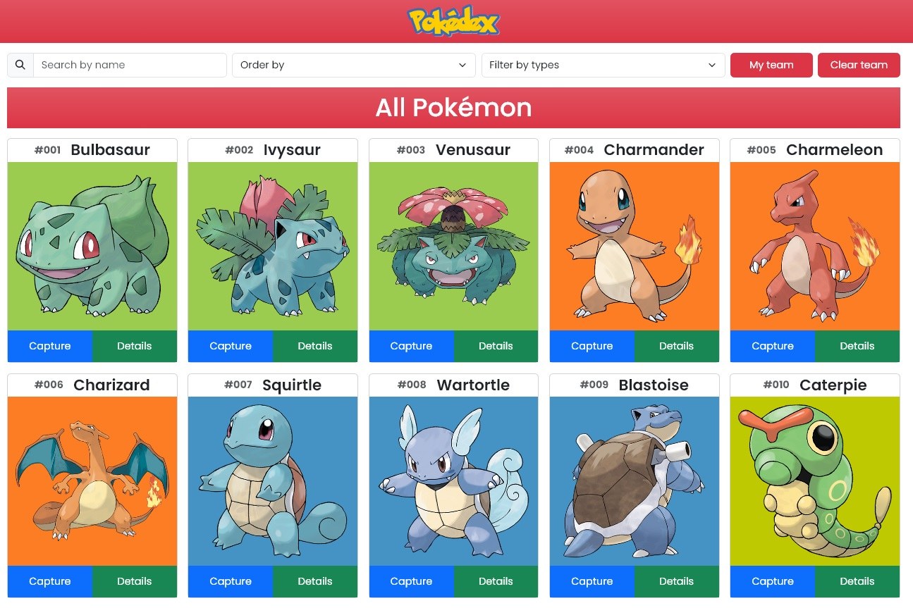

<h1>Pokédex</h1>

Project creating a Pokédex with Vanilla JS and using the PokeAPI

<h2>📄 Page preview</h2>

    

<h2>🛠️ Tools</h2>

     
     
    

    » Toastify JS  
    » Sweetalert2  
    » FontAwesome 

